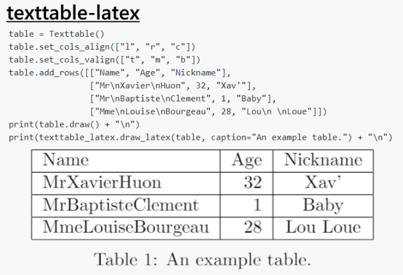

# latextable

[](https://opensource.org/licenses/MIT)

[](https://pepy.tech/project/latextable)

[Texttable](https://github.com/foutaise/texttable) is a Python package that can create simple ASCII tables.
This package extends its functionality to allow the table to be directly output in Latex, removing the tedious copy and paste chore.
The Latex output matches the table design, and there are utilities for adding table captions, labels, and positions.



## Features
- Draw a table object in a Latex format.
- Matches table decoration (border, header, hlines, vlines).
- Applies horizontal column alignment.
- Allows the user to drop certain columns from the output.
- Provides the ability to add a caption, reference label, and position to the Latex output.
- The output is correctly indented for directly copying into Latex.
- Supports [booktabs](https://ctan.org/pkg/booktabs?lang=en) formatting.

## Installation

PyPi:

```
pip install latextable
```

Requirements:

```
texttable
```

## Usage

The single function `latextable.draw_latex` returns a formatted Latex string based on the provided table.
Aside from table, all arguments are optional.


```
draw_latex(table, caption=None, label=None, drop_columns=None, position=None):
    table: Texttable table to be rendered in Latex.
    caption: A string that adds a caption to the Latex formatting.
    label: A string that adds a referencing label to the Latex formatting.
    drop_columns: A list of column names that won't be in the Latex output.
        Each column name must be in the table header.
    position: A string that represents LaTex's float position of the table.
        For example 'ht' results in the float position [ht].
    use_booktabs: Whether to override the table formatting with booktabs (https://ctan.org/pkg/booktabs?lang=en).
        If true, the texttable formatting is ignored, and instead the default booktabs style is used.
        This overrides the border, vertical lines, and horizontal lines.
        Note the booktabs package will need to be included in your Latex document (\usepackage{booktabs}).
        Defaults to false.

    return: The formatted Latex table returned as a single string.
```

### Examples
A basic example is given below.
For more see the [examples directory](examples/).

Code:

```
table_1 = Texttable()
table_1.set_cols_align(["l", "r", "c"])
table_1.set_cols_valign(["t", "m", "b"])
table_1.add_rows([["Name", "Age", "Nickname"],
                 ["Mr\nXavier\nHuon", 32, "Xav'"],
                 ["Mr\nBaptiste\nClement", 1, "Baby"],
                 ["Mme\nLouise\nBourgeau", 28, "Lou\n \nLoue"]])
print('-- Example 1: Basic --')
print('Texttable Output:')
print(table_1.draw())
print('\nLatextable Output:')
print(latextable.draw_latex(table_1, caption="An example table.", label="table:example_table"))
```

Output:

```
-- Example 1: Basic --
Texttable Output:
+----------+-----+----------+
|   Name   | Age | Nickname |
+==========+=====+==========+
| Mr       |     |          |
| Xavier   |  32 |          |
| Huon     |     |   Xav'   |
+----------+-----+----------+
| Mr       |     |          |
| Baptiste |   1 |          |
| Clement  |     |   Baby   |
+----------+-----+----------+
| Mme      |     |   Lou    |
| Louise   |  28 |          |
| Bourgeau |     |   Loue   |
+----------+-----+----------+

Latextable Output:
\begin{table}
	\begin{center}
		\begin{tabular}{|l|r|c|}
			\hline
			Name & Age & Nickname \\
			\hline
			MrXavierHuon & 32 & Xav' \\
			\hline
			MrBaptisteClement & 1 & Baby \\
			\hline
			MmeLouiseBourgeau & 28 & Lou Loue \\
			\hline
		\end{tabular}
	\end{center}
	\caption{An example table.}
	\label{table:example_table}
\end{table}
```

## Additional Info

For a more in depth article reviewing this library, see this [Medium post](https://towardsdatascience.com/how-to-create-latex-tables-directly-from-python-code-5228c5cea09a).  
A working example is also given in this [Colab Notebook](https://colab.research.google.com/drive/1Iq10lHznMngg1-Uoo-QtpTPii1JDYSQA?usp=sharing).  

## Release History

* 0.2.1
    * Removed row hlines when using booktabs.
* 0.2.0
    * Added support for booktabs and table positioning.
* 0.1.1
    * Minor changes to documentation.
* 0.1.0
    * Initial Release

## Meta

[Joseph Early](https://www.jearly.co.uk/)  
[@JosephAEarly](https://twitter.com/JosephAEarly)  
joseph.early.ai@gmail.com

Distributed under the MIT license. See ``LICENSE`` for more information.
